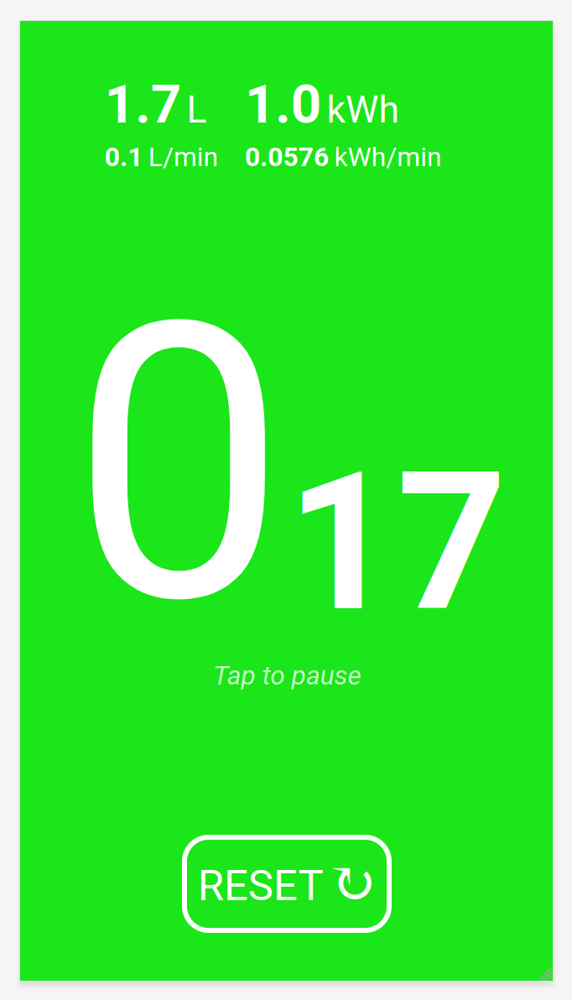

# Shower Timer

Simple app created to learn how to make PWAs.

## Usage
Changes color based on time spent. Green for ≤ 2 minutes, yellow for ≤ 3 minutes, orange for ≤ 4 minutes, and red for > 4 minutes.
It changes the entire screen's color, so it's easy to see through a fogged up shower door.
Tap to pause and resume or use the reset button to start over.

